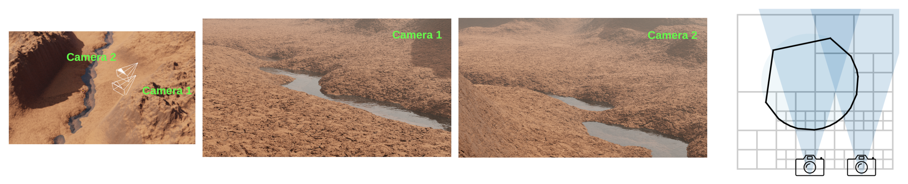

## OcMesher: View-Dependent Octree-based Mesh Extraction in Unbounded Scenes for Procedural Synthetic Data

Implementation source-code for <it>OcMesher</it>, which extracts a mesh for an unbounded scene represented by signed distance functions (SDFs). Even though the scene is unbounded, the mesh is memory-efficient, and highly detailed from a given set of camera views. OcMesher is used by default in [Infinigen](https://github.com/princeton-vl/infinigen) to speed up video generation, improve rendering quality, and export terrain meshes to external simulators.



If you use OcMesher in your work, please cite our academic paper:

<h3 align="center">
    <a href="https://arxiv.org/abs/2312.08364">
        View-Dependent Octree-based Mesh Extraction in Unbounded Scenes for Procedural Synthetic Data
    </a>
</h3>
<p align="center">
    <a href="https://mazeyu.github.io/">Zeyu Ma</a>, 
    <a href="http://araistrick.com/">Alexander Raistrick</a>, 
    <a href="https://www.lahavlipson.com/">Lahav Lipson</a>, 
    <a href="http://www.cs.princeton.edu/~jiadeng">Jia Deng</a><br>
</p>

```
@article{ocmesher2023view,
  title={View-Dependent Octree-based Mesh Extraction in Unbounded Scenes for Procedural Synthetic Data},
  author={Ma, Zeyu and Raistrick, Alexander and Lipson, Lahav and Deng, Jia},
  year={2023}
}
```

Please view the video [here](https://youtu.be/YA1c5L0Ncuw) for more qualitative results

## Getting Started

:bulb: Note: OcMesher is installed by default in Infinigen as of v1.2.0 - if you wish to use OcMesher with Infinigen please follow the Installation instructions on the infinigen repo. Use the instructions below only if you want a standalone installation & demo. 

### Standalone Installation

```
git clone https://github.com/princeton-vl/OcMesher.git
cd OcMesher
bash install.sh
conda create --name ocmesher python=3.10
conda activate ocmesher
pip install -r requirements.txt
```


### Demo

```
python demo.py
```

This example uses one camera and the Perlin Noise from the Python library `vnoise` and outputs the resulting mesh in `results/demo.obj`.
